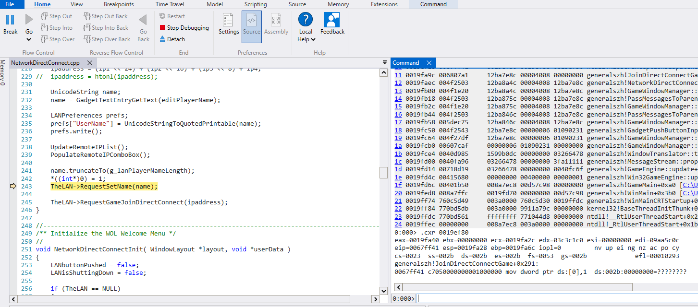

# Crash dumps

A crash dump (dump file) contains the process state at the moment it was captured.
It is primarily used to investigate unhandled exceptions when the game is not running under a debugger.
Because dump files can be shared, developers can analyze crashes that occurred on another machine.

When an unhandled exception occurs, the game writes two dumps:

- **Mini dump (small):** thread stacks (including call parameters).
- **Full dump (large):** the complete process memory.

Full dumps can be several orders of magnitude larger than mini dumps, so prefer
using the mini dump when it contains enough information.

Crash dumps are stored in a folder named `CrashDumps` under the user data directory (userDir), typically:
`Documents\Command and Conquer Generals Zero Hour Data\CrashDumps`.

## Naming format

A dump file name looks like:
`CrashFZ-20251212-173157-9d4177c4-pid12392`

Components after `Crash`:

- `F` = dump type (`F` = full, `M` = mini)
- `Z` = game (`Z` = Zero Hour, `G` = Generals)
- `20251212` = date (YYYYMMDD)
- `173157` = time (HHMMSS)
- `9d4177c4` = Git commit hash the build was produced from
- `pid12392` = PID of the crashing game process

## Debugging a crash

- **VS6 builds:** open the `.dmp` in WinDbg.
- **VS2022 builds:** use either Visual Studio 2022 or WinDbg.

### Example using WinDbg

This example shows how to locate the original fault using a *mini dump* from a VC6 build.

Assume the file is named `CrashFZ-20251212-173157-9d4177c4-pid12392.dmp`.
Then the corresponding git commit hash is `9d4177c4`, and the source code must match that commit.
Check out the commit in the TSH repo:

```cmd
git checkout 9d4177c4
```

Open the dump in [WinDbg](https://aka.ms/windbg) and make sure the PDB matches the executable.

Currently, the exception record in the dump typically shows the `DebugBreak` that triggers dump generation:

```cmd
0:000> .excr
eax=0019ec24 ebx=00000000 ecx=00d883b8 edx=00000000 esi=02ed05b8 edi=0019ef30
eip=750dedd2 esp=0019e968 ebp=0019e9a0 iopl=0         nv up ei pl nz na po nc
cs=0023  ss=002b  ds=002b  es=002b  fs=0053  gs=002b             efl=00000202
KERNELBASE!wil::details::DebugBreak+0x2:
750dedd2 cc              int     3
```

To find the *actual exception* that led to the dump, inspect the call stack.
Dump the call stack for the current thread (the one that raised the unhandled exception):

```cmd
0:000> .cxr
Resetting default scope
0:000> kb
 # ChildEBP RetAddr      Args to Child              
00 0019e8d8 75045eb8     00000364 00000000 00000000 ntdll!NtWaitForSingleObject+0xc
01 0019e948 75045e22     00000364 ffffffff 00000000 KERNELBASE!WaitForSingleObjectEx+0x88
02 0019e95c 00412ce3     00000364 ffffffff 0019ef30 KERNELBASE!WaitForSingleObject+0x12
03 0019e9a0 004031f3     0000004d 00958d48 00000005 generalszh!MiniDumper::TriggerMiniDump+0xc3 [C:\GeneralsGameCode\Core\GameEngine\Source\Common\System\MiniDumper.cpp @ 105] 
04 0019ebe8 0040fcd5     009b21c0 75491e47 0019ef30 generalszh!ReleaseCrash+0x43 [C:\GeneralsGameCode\Core\GameEngine\Source\Common\System\Debug.cpp @ 759] 
05 0019ebf0 75491e47     0019ef30 02ed05b8 0019ec10 generalszh!GameEngine::execute+0xa5 [C:\GeneralsGameCode\GeneralsMD\Code\GameEngine\Source\Common\GameEngine.cpp @ 1001] 
06 0019ec10 7548b957     0040fc97 0019fd40 00000100 msvcrt!_NLG_Return
07 0019ec3c 7548a270     0019fd40 00958cc0 0040fc97 msvcrt!_CallCatchBlock2+0x50
08 0019ecbc 7548a4cc     0019ef30 0019fd40 0019ef80 msvcrt!CallCatchBlock+0xa3
09 0019ecfc 7548aa51     0019ef30 0019fd40 0019ef80 msvcrt!CatchIt+0x69
0a 0019ed44 7548a88e     0019ef30 0019fd40 0019ef80 msvcrt!FindHandlerForForeignException+0x105
0b 0019edbc 7548afcc     0019ef30 0019fd40 0019ef80 msvcrt!FindHandler+0x354
0c 0019edf0 7548bd26     0019ef30 0019fd40 0019ef80 msvcrt!__InternalCxxFrameHandler+0xf7
0d 0019ee2c 77104362     0019ef30 0019fd40 0019ef80 msvcrt!__CxxFrameHandler+0x26
0e 0019ee50 77104334     0019ef30 0019fd40 0019ef80 ntdll!ExecuteHandler2+0x26
0f 0019ef18 770cb56f     0019ef30 0019ef80 0019ef30 ntdll!ExecuteHandler+0x24
10 0019ef18 0067ff41     0019ef30 0019ef80 0019ef30 ntdll!KiUserExceptionDispatcher+0xf
11 0019fa9c 006807a1     12ba7e8c 00004008 00000000 generalszh!JoinDirectConnectGame+0x291 [C:\GeneralsGameCode\GeneralsMD\Code\GameEngine\Source\GameClient\GUI\GUICallbacks\Menus\NetworkDirectConnect.cpp @ 243] 
12 0019faec 004f2503     12ba8a4c 00004008 12ba7e8c generalszh!NetworkDirectConnectSystem+0x2b1 [C:\GeneralsGameCode\GeneralsMD\Code\GameEngine\Source\GameClient\GUI\GUICallbacks\Menus\NetworkDirectConnect.cpp @ 527] 
13 0019fb00 004f1e20     12ba8a4c 00004008 12ba7e8c generalszh!GameWindowManager::winSendSystemMsg+0x33 [C:\GeneralsGameCode\GeneralsMD\Code\GameEngine\Source\GameClient\GUI\GameWindowManager.cpp @ 705] 
14 0019fb18 004f2503     12ba875c 00004008 12ba7e8c generalszh!PassMessagesToParentSystem+0x30 [C:\GeneralsGameCode\GeneralsMD\Code\GameEngine\Source\GameClient\GUI\GameWindowManager.cpp @ 170] 
15 0019fb2c 004f1e20     12ba875c 00004008 12ba7e8c generalszh!GameWindowManager::winSendSystemMsg+0x33 [C:\GeneralsGameCode\GeneralsMD\Code\GameEngine\Source\GameClient\GUI\GameWindowManager.cpp @ 705] 
16 0019fb44 004f2503     12ba846c 00004008 12ba7e8c generalszh!PassMessagesToParentSystem+0x30 [C:\GeneralsGameCode\GeneralsMD\Code\GameEngine\Source\GameClient\GUI\GameWindowManager.cpp @ 170] 
17 0019fb58 005dec75     12ba846c 00004008 12ba7e8c generalszh!GameWindowManager::winSendSystemMsg+0x33 [C:\GeneralsGameCode\GeneralsMD\Code\GameEngine\Source\GameClient\GUI\GameWindowManager.cpp @ 705] 
18 0019fc50 004f2543     12ba7e8c 00000006 01090231 generalszh!GadgetPushButtonInput+0x325 [C:\GeneralsGameCode\GeneralsMD\Code\GameEngine\Source\GameClient\GUI\Gadget\GadgetPushButton.cpp @ 354] 
19 0019fc64 004f27df     12ba7e8c 00000006 01090231 generalszh!GameWindowManager::winSendInputMsg+0x33 [C:\GeneralsGameCode\GeneralsMD\Code\GameEngine\Source\GameClient\GUI\GameWindowManager.cpp @ 724] 
1a 0019fcb0 00607caf     00000006 01090231 00000000 generalszh!GameWindowManager::winProcessMouseEvent+0x15f [C:\GeneralsGameCode\GeneralsMD\Code\GameEngine\Source\GameClient\GUI\GameWindowManager.cpp @ 925] 
1b 0019fce4 0040d985     1599b0dc 00000000 03266478 generalszh!WindowTranslator::translateGameMessage+0x16f [C:\GeneralsGameCode\GeneralsMD\Code\GameEngine\Source\GameClient\MessageStream\WindowXlat.cpp @ 242] 
1c 0019fd00 0040fa96     03266478 00000000 3fa11111 generalszh!MessageStream::propagateMessages+0x25 [C:\GeneralsGameCode\GeneralsMD\Code\GameEngine\Source\Common\MessageStream.cpp @ 1114] 
1d 0019fd14 00718d19     03266478 00000000 0040fc6f generalszh!GameEngine::update+0x36 [C:\GeneralsGameCode\GeneralsMD\Code\GameEngine\Source\Common\GameEngine.cpp @ 902] 
1e 0019fd4c 00415680     00000000 00400000 00000001 generalszh!Win32GameEngine::update+0x9 [C:\GeneralsGameCode\GeneralsMD\Code\GameEngineDevice\Source\Win32Device\Common\Win32GameEngine.cpp @ 93] 
1f 0019fd6c 00401b50     008a7ec8 00d57c98 00000000 generalszh!GameMain+0xa0 [C:\GeneralsGameCode\GeneralsMD\Code\GameEngine\Source\Common\GameMain.cpp @ 59] 
20 0019fed8 008a7ffc     0019fd70 00000000 00d57c98 generalszh!WinMain+0x3b0 [C:\GeneralsGameCode\GeneralsMD\Code\Main\WinMain.cpp @ 925] 
21 0019ff74 760c5d49     003a0000 760c5d30 0019ffdc generalszh!WinMainCRTStartup+0x134
22 0019ff84 770bd5db     003a0000 9911a79c 00000000 kernel32!BaseThreadInitThunk+0x19
23 0019ffdc 770bd561     ffffffff 771044d8 00000000 ntdll!__RtlUserThreadStart+0x2b
24 0019ffec 00000000     008a7ec8 003a0000 00000000 ntdll!_RtlUserThreadStart+0x1b
```

In the stack, there is a lot of exception-handling plumbing near the top.
Follow the stack down to the first call to `ntdll!KiUserExceptionDispatcher`;
its arguments include the exception record and context record for the original exception:

`10 0019ef18 0067ff41     0019ef30 0019ef80 0019ef30 ntdll!KiUserExceptionDispatcher+0xf`

Use the context record address to display and load the register context:

```cmd
0:000> .cxr 0019ef80
eax=0019fa40 ebx=00000000 ecx=0019fa2c edx=03c3c1c0 esi=00000000 edi=09aa5c0c
eip=0067ff41 esp=0019fa28 ebp=0019fa6c iopl=0         nv up ei ng nz ac po cy
cs=0023  ss=002b  ds=002b  es=002b  fs=0053  gs=002b             efl=00010293
generalszh!JoinDirectConnectGame+0x291:
0067ff41 c7050000000001000000 mov dword ptr ds:[0],1  ds:002b:00000000=????????
```

The source view should update as well:



At this point you know where the error occured, but not neccessarily what kind of exception it was.
To determine that, examine the exception record:

```cmd
0:000> .exr 0019ef30
ExceptionAddress: 0067ff41 (generalszh!JoinDirectConnectGame+0x00000291)
   ExceptionCode: c0000005 (Access violation)
  ExceptionFlags: 00000000
NumberParameters: 2
   Parameter[0]: 00000001
   Parameter[1]: 00000000
Attempt to write to address 00000000
```

You now have entire picture of what happened; An access violation when trying to write to address `0x00000000`.

In this example the *mini dump* contained enough state to determine the root cause.
If the problem was more involved and required inspecting the state of game objects, using the *full dump* would be needed.
